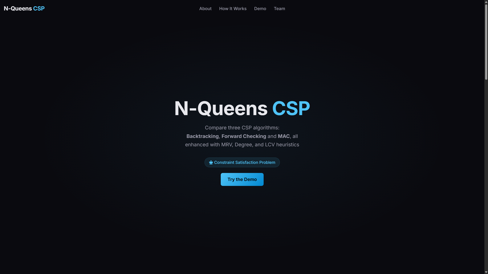

# N-Queens CSP Solver

A Spring Boot web app that solves the N-Queens problem using three CSP algorithms — Backtracking, Forward Checking, and MAC — with optional MRV, Degree, and LCV heuristics. Includes an interactive frontend for visualizing and comparing results across algorithms.



---

## Tech Stack

- **Backend:** `Java 17`, `Spring Boot 3.2`
- **Build:** `Maven`
- **Frontend:** `HTML`, `CSS`, `JavaScript`
- **Libraries:** `AOS` (scroll animations)
- **Deployment:** `Railway`

---

## Features

- **`Three CSP Algorithms`**: Backtracking (baseline), Forward Checking (domain pruning after each placement), and MAC (arc consistency via AC-3 at every step).
- **`Three Heuristics`**: MRV (choose the most constrained variable), Degree (break ties by most-constrained), and LCV (order values by least impact on neighbors) — toggleable per run.
- **`Random Start`**: Optional random initialization to diversify search paths, enabling board sizes up to N=32.
- **`Interactive Board Visualizer`**: Renders the solved chessboard per algorithm with tabbed switching between results.
- **`Metrics Comparison`**: Displays constraint checks and solve time for each algorithm side-by-side.
- **`Preset Board Sizes`**: One-click presets (4, 8, 16, 20 — and up to 32 with Random Start enabled).

---

## Process

1. Modeled N-Queens as a CSP: variables = columns, domains = rows, constraints = no two queens share a row, column, or diagonal.
2. Implemented Backtracking as the baseline recursive search.
3. Extended with Forward Checking to prune domain sizes after each queen placement.
4. Implemented AC-3 for MAC to propagate arc consistency more aggressively at each step.
5. Layered MRV, Degree, and LCV heuristics as optional enhancements on top of all three algorithms.
6. Exposed a `/api/solve` REST endpoint via Spring Boot and built a vanilla JS frontend to drive it.
7. Deployed to Railway.

---

## Running the Project

```bash
mvn spring-boot:run
```
- Live at: [n-queens.up.railway.app](https://n-queens.up.railway.app)
- Or locally at `http://localhost:8080`